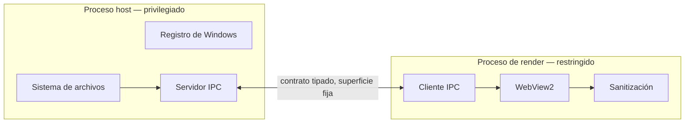

# Propuesta A — WebView2 endurecido, en dos procesos

## Resumen

Evolución directa de la v1. Se mantiene WebView2 como motor de render —
sigue siendo la única forma de tener Mermaid, KaTeX y HTML sanitizado con
fidelidad completa sin empaquetar un navegador propio— pero se separa en
dos procesos: uno con privilegios (disco, registro, shell) y otro que
renderiza el documento, comunicados por un contrato de mensajes angosto en
vez del puente actual de pywebview, que refleja métodos de Python
directamente a JavaScript.

## Qué cambia respecto a la v1

- **Arranque percibido**: una ventana nativa mínima se pinta primero, con
  el texto crudo del documento ya visible, y WebView2 se inicializa en
  paralelo por debajo. El usuario ve contenido antes de que el motor
  completo esté listo, en vez de esperar a WebView2 para ver cualquier cosa.
- **Puente angosto**: en vez de exponer clases de Python enteras a
  JavaScript, el proceso de render solo puede pedir un conjunto fijo y
  documentado de operaciones (leer bytes de una ruta ya validada, guardar,
  listar una carpeta del workspace). El proceso host valida cada pedido
  contra las reglas de contención de rutas de la v1 antes de responder —
  la misma lógica de `safe_media_path`, ahora aplicada del lado que de
  verdad importa: antes de cruzar el límite de proceso, no después.
- **Workspace y edición estructural**: se construyen sobre la base ya
  probada de pestañas y ventanas de la v1, sumando persistencia de carpetas
  y las funciones de edición de `02-requisitos.md`.

## A favor

- Riesgo de ejecución bajo: es la arquitectura que el equipo ya sabe
  construir y depurar, con un cambio concreto y acotado (la separación de
  procesos) en vez de una reescritura.
- Mejora de seguridad real y medible: un proceso comprometido por un
  documento hostil ya no tiene acceso directo a disco, tiene que pasar por
  el contrato validado del host.
- Mantiene el 100% de la fidelidad de render de la v1 (Mermaid, KaTeX,
  HTML sanitizado) sin duplicar trabajo en dos motores distintos.

## En contra

- No acerca a los números de Tinta. El piso de arranque de WebView2, aun
  optimizado, sigue siendo de cientos de milisegundos a un par de segundos
  — la mejora percibida es real, pero la cifra en frío no compite con
  1,9 MB / <100 ms.
- El rediseño del puente IPC no es trivial: hay que enumerar y tipar cada
  operación que el render necesita, y eso es superficie de diseño nueva
  que puede introducir sus propios errores si se apura.

## Costo relativo

Medio. Reutiliza casi toda la base de la v1; el trabajo nuevo real es el
contrato IPC, el splash nativo, y las funciones de workspace/edición.
