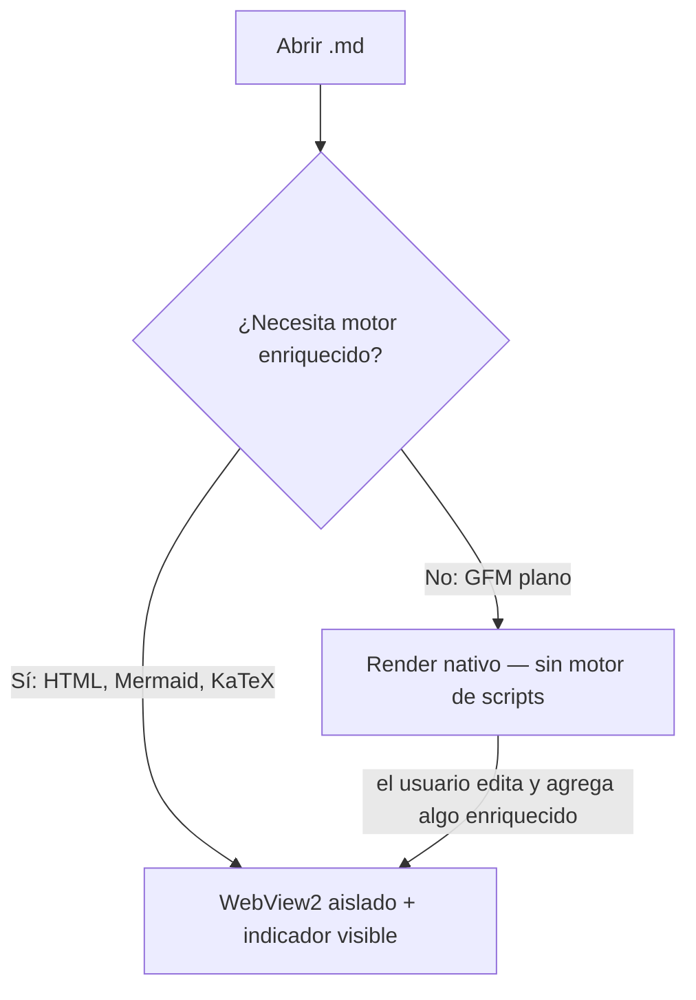

# Propuesta B — nativo por defecto, web solo por escalamiento

## Resumen

La apuesta más ambiciosa. Un renderizador nativo (C++ o Rust, en el
espíritu de MD4C + Direct2D de Tinta) atiende el caso común: Markdown GFM
sin HTML crudo y sin diagramas ni fórmulas, que en la práctica es la
mayoría de los documentos reales. Para ese caso, no hay motor de scripts
cargado en absoluto — ni sanitización que hacer, porque no hay nada que
ejecutar. Solo cuando el documento de verdad trae algo que el renderizador
nativo no puede mostrar fielmente (HTML embebido, Mermaid, KaTeX), se
inicializa una instancia de WebView2 aislada, con un indicador visible en
la interfaz ("modo enriquecido activo") para que el escalamiento nunca sea
silencioso.

## A favor

- Es la única de las tres propuestas que ataca de raíz la crítica de Tinta:
  para el caso común, el arranque y el peso podrían acercarse a los suyos,
  porque literalmente no hay motor web cargado.
- La ausencia de motor de scripts en el camino rápido no es una mitigación,
  es la ausencia estructural de la superficie de ataque — la misma
  propiedad que hace atractiva a Tinta, ahora con detección de amenazas
  igual de rigurosa que la v1 para cuando sí hace falta el motor completo.

## En contra — y son motivos reales para dudar, no obstáculos menores

- **Dos renderizadores que mantener para siempre**: cada función nueva
  (una alerta de GitHub, un cambio de tema, un ajuste de tipografía) hay
  que implementarla y probarla dos veces, en dos tecnologías distintas, y
  mantenerlas visualmente idénticas. Es el costo que ninguna de las otras
  dos propuestas paga.
- **Escribir un parser GFM nativo correcto no es un fin de semana**: MD4C,
  que usa Tinta, es el resultado de años de trabajo de un proyecto
  dedicado. Construir o adaptar algo equivalente, con la cobertura de
  casos límite que ya tiene la suite de la v1 (`tests/estres.md`,
  `tests/security/conversion-defectuosa.md`), es el ítem de mayor riesgo
  de todo este documento.
- **La heurística de escalamiento puede fallar en los dos sentidos**: un
  falso negativo muestra el documento mal (una alerta de GitHub que el
  renderizador nativo no reconoce y deja como cita común); un falso
  positivo escala a WebView2 sin necesidad y pierde toda la ventaja de
  peso y arranque que era el punto de esta propuesta.
- **No reduce el trabajo de seguridad, lo suma**: el camino WebView2 sigue
  necesitando exactamente el mismo endurecimiento que la Propuesta A — esta
  propuesta no reemplaza ese trabajo, lo hace además.

## Costo relativo

Alto. Es la única propuesta que exige construir un componente nuevo desde
cero (el renderizador nativo) con el nivel de corrección que hoy tiene el
pipeline de `markdown-it` + DOMPurify de la v1, además de todo el trabajo
de la Propuesta A para el camino de escalamiento.

## Cómo se podría explorar sin comprometerse

No haría falta decidir esto de una vez. Un prototipo acotado —renderizar
solo encabezados, párrafos, listas y tablas en nativo, medir el arranque y
el peso reales, y comparar contra la Propuesta A ya construida— daría
evidencia concreta antes de comprometer meses de trabajo en dos
renderizadores. Ver `06-comparacion-y-decision.md`.
