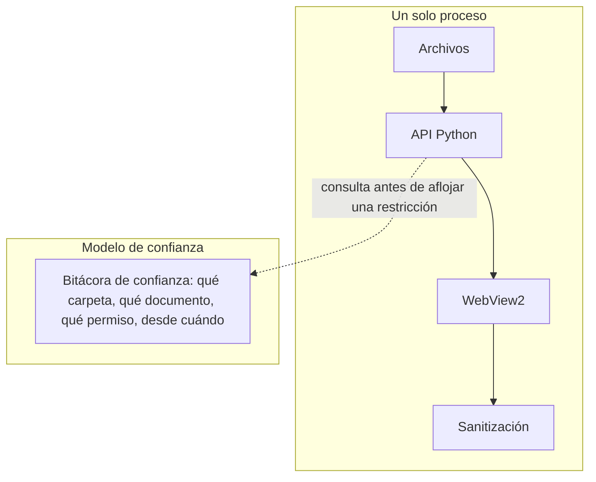

# Propuesta C — mismo motor, workspace profundo y modelo de confianza auditable

## Resumen

La apuesta de menor riesgo técnico. Se mantiene la arquitectura de un solo
proceso de la v1, casi sin tocar el núcleo de renderizado. Toda la
inversión va a dos lugares: profundidad de producto (el workspace de
ThisIs-Developer, la edición estructural de idea-multimarkdown) y un
modelo de seguridad *más visible y auditable*, sin rediseñar el proceso.

## La pieza nueva: bitácora de confianza en vez de interruptor global

La v1 ya tiene "carpetas de confianza" en su configuración avanzada, pero
es un ajuste global y silencioso: una carpeta agregada ahí queda sin
restricciones para siempre, sin registro de cuándo ni por qué. La Propuesta
C lo reemplaza por una bitácora visible: cada vez que un documento o
carpeta obtiene un permiso ampliado (cargar imágenes locales fuera de su
carpeta, por ejemplo), queda una entrada con fecha, con qué se justificó, y
un botón para revocarla. No es un cambio de arquitectura de procesos — es
hacer que una decisión de confianza que hoy es invisible después de
tomada, se pueda auditar y deshacer sin ir a buscar un archivo de
configuración a mano.

Los motores de diagramas (Mermaid, y Markmap si se suma) se cargan en un
contexto de navegación aislado dentro del mismo WebView2 —con su propio
CSP, sin acceso a las mismas APIs que el resto de la página— en vez de
compartir el DOM completo de la aplicación. Reduce lo que un diagrama
hostil podría alcanzar, sin necesitar un segundo proceso del sistema
operativo.

## A favor

- El menor riesgo de ejecución de las tres: no hay renderizador nuevo que
  escribir (a diferencia de B) ni un contrato IPC nuevo que diseñar y
  depurar (a diferencia de A). El núcleo que ya funciona en la v1 casi no
  se toca.
- La bitácora de confianza es una mejora de seguridad real y visible al
  usuario, que ninguno de los diez proyectos estudiados tiene — ninguno
  muestra un registro auditable de qué permisos se ampliaron y cuándo.
- El aislamiento de motores de diagramas en un contexto separado es una
  mejora concreta y de bajo costo sobre la v1, que hoy los mezcla en el
  mismo DOM.

## En contra

- **No responde a la crítica de Tinta.** El arranque sigue atado al piso de
  WebView2 en un solo proceso — ni siquiera tiene la mejora de arranque
  percibido que sí tiene la Propuesta A con su splash nativo. Si la
  comparación con Tinta en tamaño y velocidad es lo que más le importa al
  lector objetivo (un profesional de IT que ya conoce esa alternativa),
  esta propuesta lo deja sin respuesta.
- No separa procesos, así que no gana la mejora de seguridad más concreta
  de toda la investigación (la de Moji): un documento hostil que
  comprometiera el proceso de render seguiría en el mismo proceso que
  tiene acceso a disco.

## Costo relativo

Medio-bajo. Es mayormente trabajo de producto (workspace, edición
estructural) y de política de seguridad (la bitácora), no de arquitectura
de bajo nivel.
