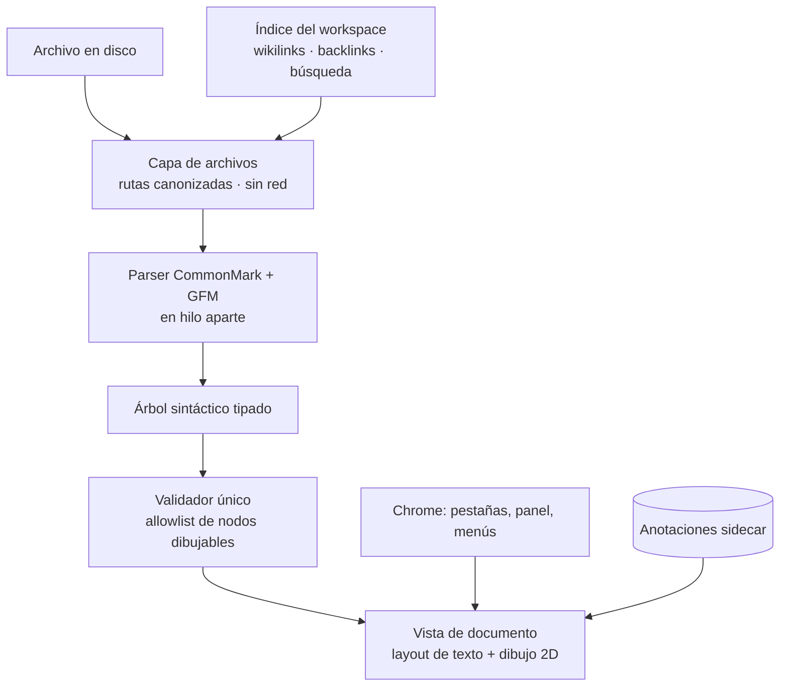

# Arquitectura

**La pila ya no es candidata: el Sprint 0 la construyó y la midió.** `comrak`,
`parley`, `swash`, `tiny-skia`, `winit` y `softbuffer` funcionan juntos y
entran en 2,14 MB. Los números están en `budget.md` y las decisiones que
salieron de ahí, en los ADR-14 a 17. Lo que sigue marcado como candidato es lo
que todavía no se construyó.

## Principios que ordenan todo lo demás

1. **Sin motor de scripts.** No hay intérprete de JavaScript en el proceso. Lo
   que un documento traiga no se ejecuta porque no hay dónde.
2. **Una sola puerta al disco.** Ninguna capa abre un archivo por su cuenta.
3. **Una sola puerta al dibujo.** Ningún nodo llega a la pantalla sin pasar por
   el validador.
4. **Nada sale del equipo.** No hay cliente HTTP en el binario del núcleo.
5. **Todo lo pesado es opcional y aparte.** El núcleo entra en el presupuesto;
   lo que no entra se descarga por separado o no existe.

## Vista de conjunto

## Las capas

### 1 · Capa de archivos

La única que toca el disco. Hereda la lógica de contención de rutas de la v1
(`safe_media_path`), reforzada en `security.md`. Reglas:

- Toda ruta se **canoniza antes** de validarse. La comprobación cae sobre el
  archivo que se va a abrir, no sobre el nombre que lo pedía.
- Las rutas de red (`\\servidor\recurso`), de dispositivo (`\\?\`, `\\.\`) y
  los flujos alternativos de NTFS se rechazan **siempre**, sin excepción ni
  permiso que las levante.
- Cada rechazo devuelve un motivo, para que la interfaz pueda explicar por qué
  en vez de fallar en silencio.

### 2 · Parser

Convierte texto en un árbol tipado. Candidato: `comrak` (CommonMark + GFM en
Rust puro). Alternativa más mínima: `pulldown-cmark`. Se decide en Fase 0 por
cobertura contra el corpus real de la v1.

**Corre fuera del hilo de interfaz.** Un `.md` de 20 MB se parsea aparte con la
ventana viva y una barra de progreso que aparece solo si el parseo pasa de
300 ms. La v1 no tiene esto y se nota.

### 3 · Validador único

El punto por el que pasa todo antes de dibujarse. No sanea HTML (no hay HTML
que ejecutar) sino que aplica una **allowlist de tipos de nodo que la vista
sabe dibujar**. Lo que está fuera se degrada a texto inerte o se descarta. Una
sola puerta, sin forma de saltearla y sin ajuste que la apague.

### 3.5 · Ventana y superficie de píxeles

Pieza que faltaba especificar: cómo se abre una ventana y cómo el dibujo llega
a la pantalla. Confirmado por investigación de mercado en agosto de 2026, los
tres crates están maduros y son la combinación estándar del ecosistema para
exactamente este caso:

| Crate | Rol | Versión verificada | Descargas |
| --- | --- | --- | --- |
| `winit` | Ventana y bucle de eventos, multiplataforma | 0.30.13 | 50 M |
| `softbuffer` | Entrega un buffer de píxeles a la ventana sin GPU | 0.4.8 | 20 M |
| `tiny-skia` | Dibuja sobre ese buffer | 0.12.0 | 43 M |

`softbuffer` no depende de la GPU ni de drivers gráficos, lo cual además
es una ventaja para las VMs descartables de Linux: no hay que lidiar con
aceleración por hardware mal configurada en un invitado virtualizado.

### 4 · Vista de documento

El corazón y el mayor riesgo del proyecto. Dibuja el árbol validado sobre la
superficie de píxeles de arriba. Pila candidata: `parley` (layout de texto),
`swash` (rasterización de glifos), `tiny-skia` (dibujo 2D por software).

`parley` (0.11.1, verificado) es la única pieza pre-1.0 de toda la lista: su
API todavía puede cambiar entre versiones menores. Igual la mantiene
Linebender, el mismo equipo de `tiny-skia`, diseñada a propósito para
combinarse con ella, es el riesgo de madurez más razonable que se puede
tomar en esta capa.

`tiny-skia` sobre Skia completo es una decisión de presupuesto: Skia solo
costaría más de 5 MB. **El Sprint 0 confirmó que el software alcanza**: 186 fps
en un documento normal y 132 en uno de 5 MB. No se evalúa GPU. Ver ADR-17.

Responsabilidades: selección de texto que cruza bloques, enlaces clicables,
resaltado de sintaxis, y **virtualización**.

### Qué virtualizar, corregido por la medición

Este documento decía antes que virtualizar era "dibujar solo lo visible". La
medición del Sprint 0 mostró que eso está mal enfocado. Dibujar nunca fue el
problema. En orden de costo real, de mayor a menor:

1. **Conservar lo maquetado.** Mantener vivos los 43.194 layouts de parley de
   un documento de 5 MB costaba **393 MB**. Guardar solo la posición de cada
   bloque y rehacer el layout de los que se ven bajó a 120 MB.
2. **Maquetar para medir.** Maquetar esos 43.194 bloques solo para saber
   cuánto mide cada uno costaba **5,1 segundos**. Estimar el alto contando
   caracteres cuesta 10 ms, con 5 % de error en la barra de scroll. ADR-16.
3. **Rasterizar glifos.** Rehacer el contorno de cada glifo en cada cuadro
   costaba 39 ms por cuadro. Con cache, 5,4 ms. ADR-15.
4. **Dibujar.** Prácticamente gratis al lado de lo anterior.

O sea: **la virtualización que importa es de layout y de memoria, no de
dibujo.** El principio operativo que queda es que el trabajo por cuadro debe
ser proporcional a lo que se ve, nunca al tamaño del documento, y que nada que
dependa del tamaño del documento puede pasar por el hilo de interfaz.

### 5 · Chrome

Pestañas, panel lateral, menús, diálogos. En Fase 0 se decide si conviene un
toolkit liviano o dibujarlo con la misma pila 2D. El estilo visual ya está
decidido y vive en `design.md`.

### 6 · Índice del workspace

Estado persistente: carpetas abiertas, recientes, favoritos, y el índice de
wikilinks y backlinks. **Incremental por diseño**: una bóveda de miles de notas
no puede reindexarse en cada arranque. Se guarda el índice con su marca de
tiempo y solo se revisan los archivos cuyo `mtime` cambió.

Candidato: SQLite embebido si el índice crece, JSON si alcanza. SQLite cuesta
~1 MB pero resuelve búsqueda y backlinks sin escribir un motor propio. Fase 0.

### 7 · Anotaciones sidecar

Resaltados y estado de repaso viven **fuera del `.md`** por defecto, en un
archivo paralelo. El formato y el porqué están en `product.md`.

## Los cuatro modos de vista

Pediste revisar la posibilidad de tener los cuatro modos de Obsidian. Se puede,
con distinto costo:

| Modo | Qué hace | Costo |
| --- | --- | --- |
| **Lectura** | Documento renderizado, con resaltado y anotaciones | Base |
| **Fuente** | Texto plano con las marcas visibles | Base |
| **Dividido** | Fuente y lectura lado a lado, scroll sincronizado | Bajo sobre los dos anteriores |
| **Edición en vivo** | Se escribe sobre el documento ya renderizado; las marcas aparecen solo en la línea del cursor | **Alto** |

**Sobre la edición en vivo**, que es la que te interesa de Obsidian: es
técnicamente el modo más difícil de todos. Exige que el cursor y la selección
existan sobre texto *renderizado* (no sobre un `<textarea>`) y que cada
pulsación reconstruya solo la parte del árbol que cambió. Es un editor de
texto enriquecido de verdad, no una vista previa.

Mi recomendación honesta: **los tres primeros en la v2.0, la edición en vivo
como el primer objetivo grande después**. Ponerla en la v2.0 arriesga que salga
a medias, y un editor en vivo que a veces pierde el cursor o corrompe una línea
es peor que no tenerlo. Queda en el roadmap con prioridad alta, no en el limbo.

## Plegado de secciones

También lo notaste en Obsidian: poder minimizar lo que hay entre dos
encabezados. Es de costo bajo y encaja natural con el árbol tipado: cada
encabezado ya conoce el rango de nodos que le pertenece hasta el siguiente
encabezado de igual o mayor nivel. Plegar es dejar de dibujar ese rango. Entra
en la v2.0.

## Modelo de procesos

Un solo proceso, sin intérprete embebido. La v1 necesitaba pensar en aislar el
motor de scripts; acá ese motor no existe, así que no hay un "proceso de render
comprometido" del que aislarse.

**La excepción declarada:** si entra IA local o un componente de diagramas
descargable, corre en **su propio proceso**, sin acceso al sistema de archivos
y con un contrato de mensajes angosto. Ver `security.md`.

## Multiplataforma

**Windows y Linux desde el primer día. macOS se compila y se prueba en
paralelo, pero no se publicita hasta tenerlo bien probado.**

El razonamiento sobre macOS, que me pediste decidir: mantener la puerta abierta
cuesta poco (elegir dependencias portables y no pegarse a APIs de Windows fuera
de la capa de integración), mientras que retrofitear después cuesta mucho:
obliga a desarmar suposiciones ya metidas en todo el código. Así que se compila
en macOS desde temprano y se publica cuando tenga pruebas propias. Barato ahora,
sin deuda después.

Lo específico de cada sistema vive en **una sola capa de integración**, con una
implementación por plataforma. El resto del código no sabe dónde corre.

| Pieza | Windows | Linux | macOS |
| --- | --- | --- | --- |
| Asociación de archivos | Registro en `HKCU` | `.desktop` + `xdg-mime` | `Info.plist` |
| Distribución | Portable + Store | AppImage + `.deb` | `.app` |
| Siempre encima | `SetWindowPos` | Sugerencia al gestor de ventanas | `NSWindow.level` |

Nota honesta sobre Linux: "siempre encima" es una *sugerencia* al gestor de
ventanas, no una orden. Algunos compositores de Wayland la ignoran. La función
se ofrece y se degrada con aviso donde no aplique.

## Qué se hereda de la v1 sin cambios conceptuales

- Contención de rutas.
- Política de red: abrir un documento no genera ninguna petición.
- Se fija como programa predeterminado para `.md`.
- Distribución portable, sin instalador obligatorio.
- Disciplina de pruebas: la suite afirma propiedades, no ausencia de crash.
