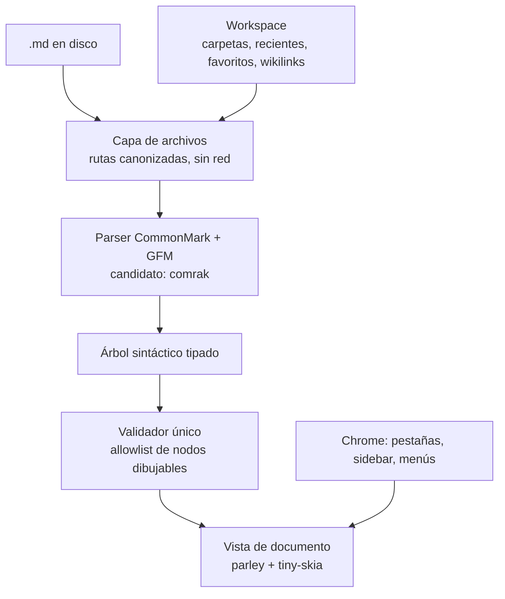

# Arquitectura

Todo lo de acá es plan, no código. Los nombres de crates son candidatos a
validar en la Fase 0, no dependencias fijadas.

## Vista de conjunto

## Las capas, de abajo hacia arriba

### 1. Capa de archivos

La única que toca el disco. Hereda entera la lógica de contención de rutas de
la v1 (`safe_media_path`): toda ruta se canoniza antes de validarse, las rutas
de red se rechazan siempre, los flujos alternativos de NTFS se rechazan. En un
binario nativo esto es aún más directo que en la v1 —no hay un puente entre
Python y JavaScript que cruzar— pero la regla es la misma.

Ninguna otra capa abre un archivo por su cuenta. Si el renderizador necesita
una imagen local, se la pide a esta capa, que valida la ruta y decide.

### 2. Parser

Convierte el texto en un árbol sintáctico tipado. Candidato: `comrak`
(CommonMark + GFM en Rust puro: tablas, tareas, notas al pie, tachado,
autolinks). Alternativa más rápida y más mínima: `pulldown-cmark`. La elección
se decide en Fase 0 por cobertura de GFM contra el corpus de la v1
(`tests/estres.md`).

El parser corre **fuera del hilo de interfaz** para documentos grandes: un
`.md` de 20 MB se parsea en un hilo aparte y la UI muestra progreso, en vez de
trabarse. Es la lección de Moji, que la v1 no tiene.

### 3. Validador único

El punto por el que pasa todo antes de dibujarse. No sanea HTML —no hay HTML
que ejecutar— sino que aplica una **allowlist de tipos de nodo que la vista
sabe dibujar**. Un nodo fuera de la lista (un bloque HTML crudo raro, un
esquema de enlace no permitido) se degrada a texto inerte o se descarta. Es el
ADR-4 hecho código: una sola puerta, sin forma de saltearla.

### 4. Vista de documento

El corazón y el mayor riesgo. Dibuja el árbol validado sobre una superficie
2D. Pila candidata:

- **`parley`** — layout de texto: dónde va cada glifo, saltos de línea,
  estilos inline mezclados, dirección de texto.
- **`swash`** — rasterización de glifos desde las fuentes del sistema (no se
  embeben fuentes pesadas; se usan las de Windows).
- **`tiny-skia`** — dibujo 2D por software. Se elige sobre Skia completo o
  sobre un backend GPU porque mantiene el binario chico (ver `calculos.md`);
  si la Fase 0 muestra que el scroll de documentos grandes no rinde por
  software, se evalúa `vello` (GPU) midiendo el costo en tamaño.

Esta vista maneja selección de texto que cruza bloques, enlaces clicables,
resaltado de sintaxis en bloques de código (candidato: gramáticas
`tree-sitter`, o `syntect` si su peso entra), y scroll fluido.

### 5. Chrome

Pestañas, barra lateral del workspace, menús, diálogos, configuración. Esto sí
es UI de widgets, y puede apoyarse en un toolkit liviano (Slint o egui) **o**
dibujarse con la misma pila 2D que el documento. La decisión se toma en Fase 0:
si un toolkit agrega pocos MB y ahorra semanas, se usa; si rompe el
presupuesto, se dibuja a mano. No se fija de antemano.

### 6. Workspace

Estado persistente entre sesiones: qué carpetas están abiertas, recientes,
favoritos, y el índice de wikilinks de la bóveda. Vive en un archivo de
configuración local (candidato: SQLite embebido si el índice crece, o JSON si
alcanza). Es lo que separa "abre un archivo" de "herramienta de trabajo", y lo
que la v1 no tiene.

## Modelo de procesos

A diferencia de la v1 (un proceso, un puente pywebview ancho), la v2 nativa no
necesita separar procesos por la misma razón: **no hay un motor de scripts no
confiable corriendo dentro del proceso**. El documento nunca ejecuta código, así
que no hay un "proceso de render comprometido" del que aislarse. La superficie
que la Propuesta A de la exploración quería angostar con IPC, acá directamente
no existe. Un proceso, sin intérprete embebido, es más simple y más seguro que
dos procesos alrededor de un webview.

## Qué se hereda de la v1 sin cambios conceptuales

- Contención de rutas (`safe_media_path`).
- Política de red: abrir un documento no genera ninguna petición. En nativo es
  trivial de garantizar —la capa de archivos es la única que podría tocar la
  red, y no lo hace.
- Se fija como programa predeterminado de Windows para `.md`.
- Distribución portable.
- Disciplina de pruebas: la suite afirma propiedades, no ausencia de crash.
