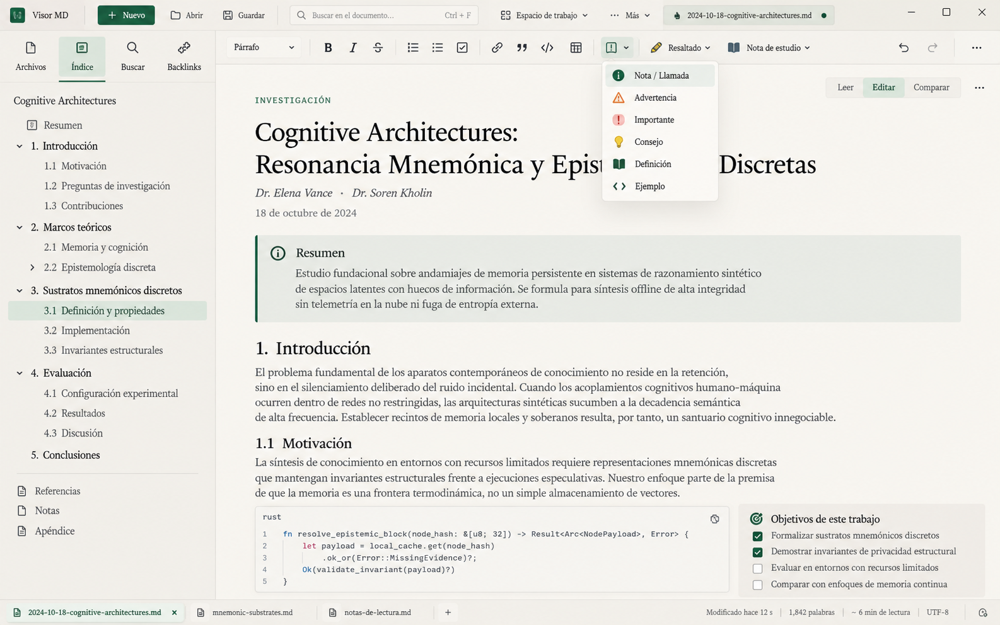
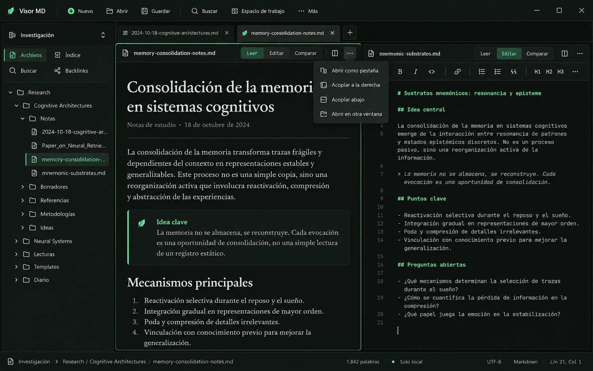

# Propuestas visuales de septiembre de 2026

Estas imágenes exploran dos lecturas del sistema visual de Visor MD. Son
referencias para decidir jerarquía y composición; no describen funciones ya
implementadas ni autorizan copiar capacidades ajenas al producto.

## A. Estudio editorial claro

La [variante con fondo transparente](visor-md-concept-a-editorial-light-transparent.png)
permite reutilizar la ventana aislada en comparaciones y presentaciones sin
alterar la propuesta original.

Prioriza un documento grande, el modo diurno Papel + Tinta y un índice completo
acoplado a la izquierda solo porque fue invocado. El kit Markdown ocupa una
segunda barra contextual y el selector Leer, Editar y Comparar pertenece al
panel activo.

## B. Workspace bosque

Explora el modo oscuro de bosque profundo y dos archivos distintos acoplados en
una misma ventana. Cada hoja conserva su propio modo. El menú de destino hace
explícitas cuatro opciones: pestaña, derecha, abajo u otra ventana.

## Decisiones compartidas

- un documento grande es el estado normal;
- dividir es excepcional, pero fácil y descubrible;
- Archivos, Índice, Buscar y Backlinks comparten una columna completa bajo
  demanda, nunca una solapa corta;
- archivo y navegación viven en la primera barra; formato o lectura en una
  segunda barra contextual;
- Leer, Editar y Comparar son estado de cada documento o panel, no de toda la
  ventana;
- día y noche son alternativas completas elegidas por la persona;
- se descartan IA embebida, cifrado ficticio, grafos, sincronización y otras
  funciones decorativas presentes en las referencias de Stitch.

Los originales de Stitch se usaron como referencias de estilo y estructura.
Las capturas de esta carpeta fueron generadas específicamente para Visor MD con
los requisitos anteriores.
